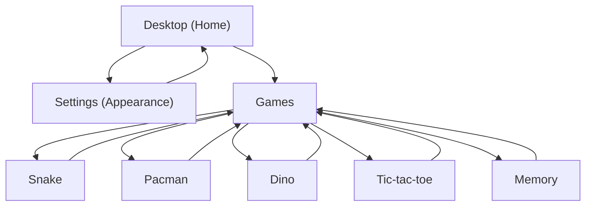

## 1. Product Overview
Aplikasi “desktop” di web untuk menjalankan beberapa app di dalam window (mirip OS) dengan tema light/dark.
Fokus update: tombol window control adaptif per theme, ikon desktop bisa di-drag dan tersimpan, serta app “Games” berisi 5 mini game.

## 2. Core Features

### 2.1 Feature Module
Kebutuhan produk terdiri dari halaman utama berikut:
1. **Desktop (Home)**: area desktop + ikon app, window manager, tombol window control adaptif theme.
2. **Games**: daftar 5 game, area bermain game terpilih, kontrol dasar game (start/restart/pause jika relevan), tombol kembali.
3. **Settings (Appearance)**: pengaturan theme light/dark (atau mengikuti sistem jika sudah ada), preview perubahan.

### 2.3 Page Details
| Page Name | Module Name | Feature description |
|-----------|-------------|---------------------|
| Desktop (Home) | Desktop icons | Menampilkan ikon app di desktop dan mengizinkan drag-and-drop untuk mengatur posisi. |
| Desktop (Home) | Icon position persistence | Menyimpan posisi ikon setelah drag selesai dan memuat ulang posisi tersebut saat refresh/reopen. |
| Desktop (Home) | Window manager | Membuka app dalam window (mis. Settings, Games), fokus window aktif, dan menutup/minimize/maximize sesuai kontrol yang ada. |
| Desktop (Home) | Window control (theme adaptive) | Merender tombol minimize/maximize/close dengan gaya/warna yang menyesuaikan theme light/dark agar kontras dan konsisten. |
| Games | Game launcher | Menampilkan 5 mini game (Snake, Pacman, Dino, Tic-tac-toe, Memory) dan memilih salah satu untuk dimainkan. |
| Games | Game runtime container | Menjalankan game terpilih di area bermain yang sama (canvas/DOM), serta menyediakan aksi minimal: start/restart dan keluar/kembali ke daftar. |
| Games | Basic input handling | Mendukung input keyboard/touch dasar per game (mis. arah untuk Snake/Pacman, lompat untuk Dino, klik/tap untuk Tic-tac-toe/Memory). |
| Settings (Appearance) | Theme selection | Mengubah theme (light/dark) dan menerapkan perubahan ke seluruh UI termasuk window control. |
| Settings (Appearance) | Theme persistence | Menyimpan preferensi theme dan memulihkannya saat reload (jika mekanisme theme persistence sudah ada, fitur ini mengandalkan mekanisme tersebut). |

## 3. Core Process
**Alur Desktop & Theme**
1. Kamu membuka Desktop.
2. Kamu membuka Settings lalu memilih theme light/dark.
3. UI berubah sesuai theme, termasuk tombol window control di titlebar.

**Alur Drag Ikon Desktop (Persist)**
1. Kamu drag ikon app ke posisi yang diinginkan.
2. Saat drag selesai, sistem menyimpan koordinat/posisi ikon.
3. Saat halaman di-refresh, ikon muncul di posisi terakhir.

**Alur App Games**
1. Kamu klik ikon “Games” di Desktop.
2. Window Games terbuka, kamu memilih salah satu game.
3. Kamu bermain, lalu restart atau kembali ke daftar game.
4. Kamu menutup window Games untuk kembali ke Desktop.

