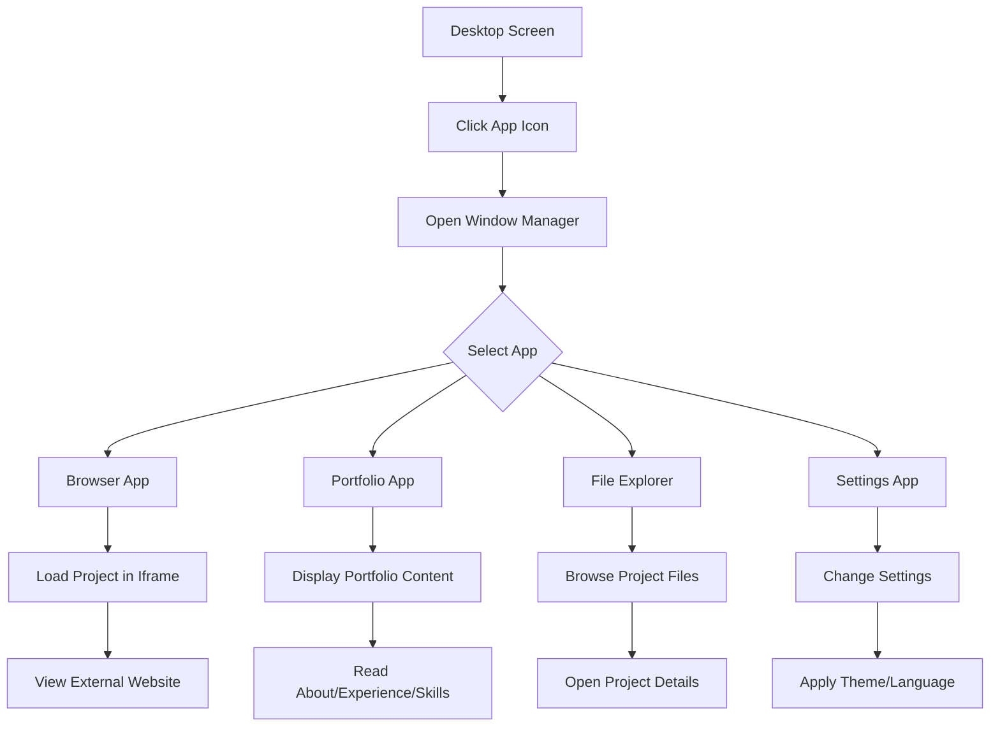

## 1. Product Overview
Website portfolio personal berbentuk operating system berbasis web yang menyediakan pengalaman desktop-like untuk menampilkan project dan informasi personal. Proyek ini memungkinkan visitor menjelajahi portfolio melalui antarmuka OS yang familiar dan interaktif.

Target pengguna adalah recruiter, client, dan developer lain yang ingin melihat portfolio dan project yang pernah dikerjakan dalam format yang unik dan memorable.

## 2. Core Features

### 2.1 User Roles
| Role | Registration Method | Core Permissions |
|------|---------------------|------------------|
| Visitor | No registration required | Browse portfolio, use OS features, open windows |
| Admin | Secure login | Manage content, update projects, system settings |

### 2.2 Feature Module
Website portfolio OS ini terdiri dari halaman-halaman berikut:
1. **Desktop Screen**: Area kerja utama dengan wallpaper, dock/taskbar, dan shortcut aplikasi.
2. **Window Manager**: Sistem jendela untuk membuka dan mengelola aplikasi-portfolio.
3. **Browser App**: Aplikasi browser internal untuk membuka project portfolio dalam iframe.
4. **Portfolio App**: Aplikasi untuk menampilkan About Me, Experience, dan Skills.
5. **File Explorer**: Aplikasi untuk menjelajahi project dan file portfolio.
6. **Settings App**: Pengaturan tema, bahasa, dan preferensi lainnya.

### 2.3 Page Details
| Page Name | Module Name | Feature description |
|-----------|-------------|---------------------|
| Desktop Screen | Desktop Area | Menampilkan wallpaper, ikon aplikasi, dan area kerja yang dapat diklik. Support drag-and-drop untuk ikon. |
| Desktop Screen | Dock/Taskbar | Menampilkan aplikasi yang sedang berjalan, shortcut aplikasi, dan system tray dengan jam. |
| Desktop Screen | System Menu | Menu utama untuk shutdown, restart, dan pengaturan sistem. |
| Window Manager | Window Container | Container untuk setiap aplikasi yang dapat di-drag, minimize, maximize, dan close. |
| Window Manager | Window Controls | Tombol minimize, maximize, close di pojok kanan atas setiap window. |
| Window Manager | Window Title Bar | Menampilkan judul aplikasi dan icon aplikasi. |
| Browser App | Address Bar | Input URL untuk browsing, tombol back/forward/reload. |
| Browser App | Content Area | Iframe untuk menampilkan website eksternal project portfolio. |
| Browser App | Tab Management | Multiple tabs untuk membuka beberapa website sekaligus. |
| Portfolio App | About Me Section | Menampilkan informasi personal, foto, dan deskripsi singkat. |
| Portfolio App | Experience Section | Timeline pengalaman kerja dengan detail posisi dan periode. |
| Portfolio App | Skills Section | Daftar skill teknis dan level kemahiran dengan visual indicator. |
| File Explorer | Folder Structure | Navigasi folder untuk project-project yang pernah dibuat. |
| File Explorer | File Preview | Preview konten file sebelum dibuka. |
| File Explorer | Search Function | Fitur pencarian untuk file dan folder. |
| Settings App | Theme Switcher | Toggle antara light mode dan dark mode. |
| Settings App | Language Settings | Pilihan bahasa untuk interface. |
| Settings App | System Preferences | Pengaturan animasi, sound effects, dan lainnya. |

## 3. Core Process
### Visitor Flow
1. Visitor membuka website dan langsung masuk ke desktop screen
2. Visitor dapat melihat desktop dengan wallpaper dan ikon aplikasi
3. Visitor mengklik aplikasi (Browser, Portfolio, File Explorer) untuk membuka window
4. Setiap window dapat di-drag, minimize, maximize sesuai kebutuhan
5. Visitor menggunakan Browser App untuk membuka project portfolio dalam iframe
6. Visitor menjelajahi portfolio melalui berbagai aplikasi yang tersedia
7. Visitor dapat mengubah tema dan pengaturan melalui Settings App

### Admin Flow
1. Admin login melalui special key combination atau hidden login button
2. Admin dapat mengupdate konten portfolio melalui admin interface
3. Admin dapat menambah, mengedit, atau menghapus project
4. Admin dapat mengubah system settings dan preferences

## 4. User Interface Design
### 4.1 Design Style
- **Primary Color**: #2563EB (Blue)
- **Secondary Color**: #9333EA (Purple)
- **Accent Color**: #F59E0B (Amber)
- **Neutral Background**: #F9FAFB (Light Gray)
- **Text Color**: #111827 (Dark Gray) / #6B7280 (Medium Gray)
- **Error Color**: #DC2626 (Red)
- **Success Color**: #16A34A (Green)

- **Font**: IBM Plex Sans (global font)
- **Button Style**: Rounded corners (rounded-2xl), solid background
- **Layout Style**: Desktop-like dengan window management
- **Icon Style**: Lucide React icons dengan stroke-width 2
- **Animation**: Smooth transitions menggunakan Framer Motion

### 4.2 Page Design Overview
| Page Name | Module Name | UI Elements |
|-----------|-------------|-------------|
| Desktop Screen | Desktop Area | Full-screen background dengan subtle gradient atau texture, wallpaper yang dapat di-customize. Ikon aplikasi dalam grid layout dengan label text dibawahnya. |
| Desktop Screen | Dock/Taskbar | Horizontal bar di bagian bawah dengan glassmorphism effect. Icon aplikasi yang dapat di-pin, indicator untuk app yang aktif. System tray dengan digital clock. |
| Window Manager | Window Frame | Rounded corners (rounded-xl), shadow-lg untuk depth. Title bar dengan window controls di kanan. Resizable border dengan handle di sudut. |
| Browser App | Toolbar | Address bar dengan back/forward/reload buttons, tab bar untuk multiple tabs. Modern browser-like appearance. |
| Portfolio App | Content Layout | Clean card-based layout dengan timeline untuk experience, skill bars untuk technical skills, dan profile section dengan avatar. |
| File Explorer | Navigation | Tree-view folder structure di kiri, content area di kanan dengan grid/list view toggle. Breadcrumbs untuk navigasi. |

### 4.3 Responsiveness
- **Desktop-first approach**: Optimized untuk desktop experience
- **Minimum resolution**: 1024x768 pixels
- **Touch interaction**: Support untuk tablet dengan touch-friendly buttons
- **Mobile**: Fallback ke simplified mobile view jika diperlukan

### 4.4 Window Management System
- Windows dapat di-drag menggunakan title bar
- Snap-to-edge functionality untuk window tiling
- Window layering dengan z-index management
- Minimize ke dock dengan smooth animation
- Maximize dengan preserve aspect ratio option