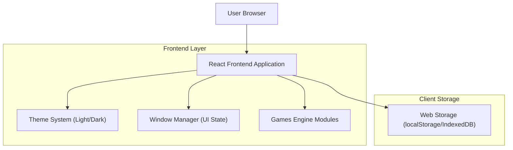

## 1.Architecture design


## 2.Technology Description
- Frontend: React@19 + TypeScript@5 + vite + tailwindcss@4 (atau CSS Modules bila tidak memakai Tailwind)
- Backend: None (persistensi posisi ikon & theme dilakukan di client storage)

## 3.Route definitions
| Route | Purpose |
|-------|---------|
| / | Desktop (Home): desktop icons + window manager |
| /apps/games | Games: daftar game + area bermain game |
| /apps/settings/appearance | Settings Appearance: pengaturan theme light/dark |

## 6.Data model(if applicable)
### 6.1 Data model definition
Persistensi dilakukan di sisi klien.
- `desktopIconPositions`: menyimpan posisi ikon per app.
- `themePreference`: menyimpan theme (jika belum tersedia mekanisme yang ada).

### 6.2 Data Definition Language
Tidak ada database/DDL karena tidak ada backend.

**Contoh bentuk data (client storage)**
```json
{
  "desktopIconPositions": {
    "games": { "x": 96, "y": 128 },
    "settings": { "x": 96, "y": 224 }
  },
  "themePreference": "dark"
}
```