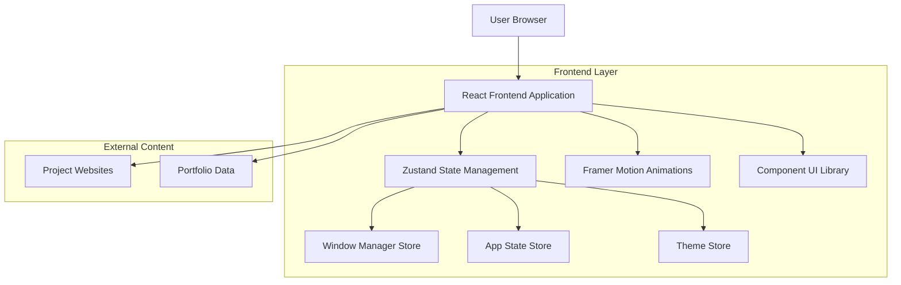

## 1. Architecture design



## 2. Technology Description
- **Frontend**: React@18 + tailwindcss@3 + vite
- **Initialization Tool**: vite-init
- **State Management**: Zustand
- **Animation**: Framer Motion
- **Icons**: Lucide React
- **Backend**: None (Static content for initial release)
- **Content Delivery**: Static JSON files for portfolio data

## 3. Route definitions
| Route | Purpose |
|-------|---------|
| / | Main desktop screen, entry point |
| /desktop | Desktop environment with window management |
| /app/browser | Browser application route (handled by window manager) |
| /app/portfolio | Portfolio application route |
| /app/explorer | File explorer application route |
| /app/settings | Settings application route |

Note: Semua routes akan ditangani oleh React Router dengan window management system.

## 4. Component Architecture

### 4.1 Core Components Structure
```
src/
├── components/
│   ├── ui/                    # Reusable UI components
│   │   ├── Button.tsx
│   │   ├── Window.tsx
│   │   ├── Dock.tsx
│   │   ├── Taskbar.tsx
│   │   └── Icon.tsx
│   ├── desktop/
│   │   ├── DesktopScreen.tsx
│   │   ├── Wallpaper.tsx
│   │   └── DesktopIcon.tsx
│   ├── windows/
│   │   ├── WindowManager.tsx
│   │   ├── WindowContainer.tsx
│   │   └── WindowControls.tsx
│   ├── apps/
│   │   ├── BrowserApp.tsx
│   │   ├── PortfolioApp.tsx
│   │   ├── FileExplorer.tsx
│   │   └── SettingsApp.tsx
│   └── layout/
│       ├── Layout.tsx
│       └── GlobalStyles.tsx
├── stores/
│   ├── windowStore.ts        # Window management state
│   ├── appStore.ts           # Application state
│   ├── themeStore.ts         # Theme and preferences
│   └── desktopStore.ts       # Desktop configuration
├── hooks/
│   ├── useWindowDrag.ts
│   ├── useWindowResize.ts
│   └── useTheme.ts
├── utils/
│   ├── windowHelpers.ts
│   ├── animationHelpers.ts
│   └── themeHelpers.ts
└── data/
    ├── portfolio.json
    ├── projects.json
    └── settings.json
```

### 4.2 State Management
```typescript
// Window Store Interface
interface WindowStore {
  windows: Window[];
  activeWindow: string | null;
  windowOrder: string[];
  
  createWindow: (app: App, position: Position) => void;
  closeWindow: (id: string) => void;
  minimizeWindow: (id: string) => void;
  maximizeWindow: (id: string) => void;
  updateWindowPosition: (id: string, position: Position) => void;
  updateWindowSize: (id: string, size: Size) => void;
  setActiveWindow: (id: string) => void;
}

// App Store Interface
interface AppStore {
  installedApps: App[];
  runningApps: string[];
  dockApps: string[];
  
  launchApp: (appId: string) => void;
  closeApp: (appId: string) => void;
  addToDock: (appId: string) => void;
  removeFromDock: (appId: string) => void;
}

// Theme Store Interface
interface ThemeStore {
  theme: 'light' | 'dark';
  accentColor: string;
  wallpaper: string;
  
  setTheme: (theme: 'light' | 'dark') => void;
  setAccentColor: (color: string) => void;
  setWallpaper: (wallpaper: string) => void;
}
```

### 4.3 Window Management System
```typescript
interface Window {
  id: string;
  appId: string;
  title: string;
  position: { x: number; y: number };
  size: { width: number; height: number };
  state: 'normal' | 'minimized' | 'maximized';
  zIndex: number;
  isActive: boolean;
  isResizable: boolean;
  isDraggable: boolean;
}

interface App {
  id: string;
  name: string;
  icon: string;
  component: React.ComponentType;
  defaultSize: { width: number; height: number };
  minSize: { width: number; height: number };
  maxSize?: { width: number; height: number };
  isResizable: boolean;
  isMaximizable: boolean;
}
```

## 5. Data Models

### 5.1 Portfolio Data Structure
```json
{
  "personalInfo": {
    "name": "string",
    "title": "string",
    "bio": "string",
    "photo": "string",
    "contact": {
      "email": "string",
      "phone": "string",
      "linkedin": "string",
      "github": "string"
    }
  },
  "experience": [
    {
      "id": "string",
      "company": "string",
      "position": "string",
      "startDate": "string",
      "endDate": "string",
      "description": "string",
      "technologies": ["string"]
    }
  ],
  "skills": [
    {
      "id": "string",
      "name": "string",
      "level": 1-10,
      "category": "string",
      "icon": "string"
    }
  ],
  "projects": [
    {
      "id": "string",
      "name": "string",
      "description": "string",
      "url": "string",
      "github": "string",
      "technologies": ["string"],
      "images": ["string"],
      "featured": "boolean"
    }
  ]
}
```

### 5.2 System Configuration
```json
{
  "theme": {
    "default": "light",
    "accentColors": ["#2563EB", "#9333EA", "#F59E0B"],
    "wallpapers": ["default.jpg", "minimal.jpg", "gradient.jpg"]
  },
  "apps": {
    "browser": {
      "defaultUrl": "about:blank",
      "bookmarks": [
        {
          "name": "string",
          "url": "string",
          "icon": "string"
        }
      ]
    },
    "settings": {
      "categories": ["appearance", "behavior", "advanced"]
    }
  }
}
```

## 6. Performance Optimization

### 6.1 Window Rendering Optimization
- Virtual rendering untuk windows yang tidak terlihat
- Lazy loading untuk app components
- Memoization untuk window state yang tidak berubah
- Debouncing untuk resize dan drag operations

### 6.2 Animation Performance
- GPU acceleration untuk transform animations
- RequestAnimationFrame untuk smooth dragging
- CSS transitions untuk simple animations
- Framer Motion untuk complex animations dengan spring physics

### 6.3 Memory Management
- Cleanup event listeners saat window ditutup
- Unmount components yang tidak terlihat
- Garbage collection untuk unused window references
- Limit jumlah windows yang dapat dibuka

## 7. Security Considerations

### 7.1 Iframe Security
- Sandbox attributes untuk browser app
- Content Security Policy untuk external resources
- Validation untuk URLs yang dimasukkan
- Prevent clickjacking dengan proper headers

### 7.2 Data Protection
- No sensitive data in client-side storage
- Sanitization untuk user inputs
- HTTPS enforcement untuk external content
- Rate limiting untuk API calls (jika ada backend)

## 8. Browser Compatibility
- Chrome 90+ (Recommended)
- Firefox 88+
- Safari 14+
- Edge 90+
- Mobile Safari (iOS 14+)
- Chrome Android (Latest)

## 9. Development Tools
- **Package Manager**: pnpm
- **Build Tool**: Vite
- **Code Quality**: ESLint + Prettier
- **Testing**: Playwright (E2E), Vitest (Unit)
- **Type Checking**: TypeScript 5.x
- **Git Hooks**: Husky + lint-staged
- **Deployment**: Static hosting (Vercel/Netlify)